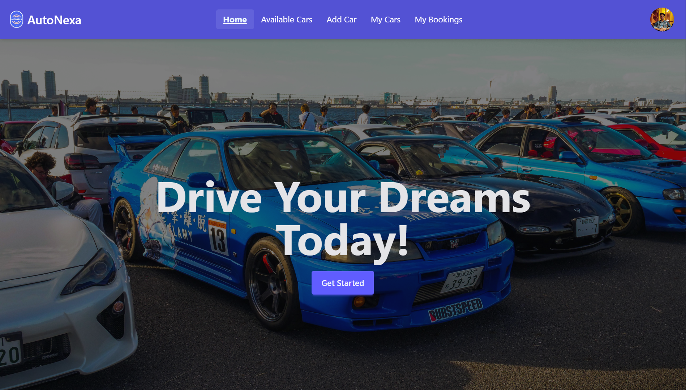

# Autonexa

## 📄 Description
Autonexa is a modern car rental web application that allows users to browse, book, and manage car rentals with ease.

🔗 **Live Site:** [https://autonexa.vercel.app/](https://autonexa.vercel.app/)

## 🖼️ Screenshot

## ⚙️ Technologies Used
React.js, Node.js, Express.js, MongoDB, Tailwind CSS, Firebase Auth

## 🚀 Core Features
- User registration & authentication
- Search and filter cars by category, price, etc.
- Car booking system with calendar integration
- Admin panel for managing listings & bookings
- Responsive UI with clean design

## 📦 Dependencies
- react-router-dom
- axios
- jsonwebtoken
- mongoose
- firebase

## 🛠️ How to Run Locally

1. Clone the repository
2. Run npm install to install dependencies
3. Set up .env file with MongoDB and Firebase credentials
4. Run npm run dev to start the development server

---
🔗 **Live Project:** [https://autonexa.vercel.app/](https://autonexa.vercel.app/)
